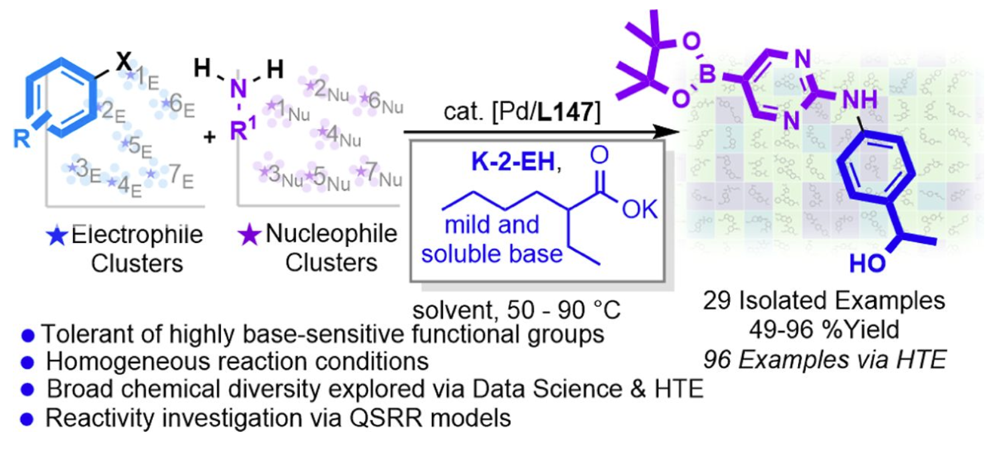

# Unleashing the Power of Potassium 2‑Ethylhexanoate as a Mild and Soluble Base for Pd-Catalyzed C−N Cross-Coupling
<p align="center">
  
</p>
<a href="https://doi.org/10.5281/zenodo.17466975">
  
</a>

## Overview

This repository contains the code and data associated with the paper _**"Unleashing the Power of Potassium 2‑Ethylhexanoate as a Mild and Soluble Base for Pd-Catalyzed C−N Cross-Coupling"**_.


## Project

This project is divided into two main components:
*   `ligand-qsar`: A chemoinformatic investigation of ligand reactivity and yields.
*   `substrate-space`: Substrate clustering and selection for High-Throughput Experimentation (HTE).

## Installation

This repository uses [uv](https://github.com/astral-sh/uv) for dependency management.

First, install `uv`. Then, clone the repository and create the virtual environment by running the following commands:

```bash
git clone git@github.com:Hartwig-Group/Abbvie-CN-Couplings-QSRR-and-HTE.git
cd Abbvie-CN-Couplings-QSRR-and-HTE
uv sync
```

To run scripts or notebooks, use the `uv run` command, which executes commands within the managed virtual environment.

**Run a Python script:**
```bash
uv run python my_script.py
```

**Run Jupyter Lab:**
For guidance on integrating `uv` with IDEs or other tools, refer to the official [integration guide](https://docs.astral.sh/uv/guides/integration/). To launch Jupyter Lab, you can run:

```bash
uv run --with jupyter jupyter lab
```

## Repository Structure

```
Abbvie-CN-Couplings-QSRR-and-HTE/
|-- data/
|   |-- ligand-qsar/
|-- notebooks/
|   |-- ligand-qsar/
|   |-- substrate-space/
|-- pyproject.toml
|-- uv.lock
|-- README.md
```

*   **`data/`**: Contains the datasets used in the project, organized by component.
*   **`notebooks/ligand-qsar/`**: Jupyter notebooks for the QSRR modeling of ligand reactivity.
*   **`notebooks/substrate-space/`**: Jupyter notebooks for:
    1.  Scraping literature reactions.
    2.  Calculating RDF descriptors.
    3.  Clustering substrates using these descriptors and selecting them for HTE.
    4.  Analyzing HTE results.
    > **Note:** The calculation of substrate descriptors requires a separate environment due to specific dependencies. Instructions for creating this environment are detailed in the `preparation.ipynb` notebook within this directory. This secondary environment is *only* for the descriptor calculation step.
*   **`pyproject.toml`**: Project metadata and dependencies, managed by `uv`.
*   **`uv.lock`**: A lockfile that ensures reproducible installation of dependencies.
*   **`README.md`**: This file.

## Citation

If you use the code or data from this repository in your work, please cite our paper:

```bibtex
@article{YourLastName_2024,
  title={Unleashing the Power of Potassium 2-Ethylhexanoate as a Mild and Soluble Base for Pd-catalyzed C-N Cross-Coupling},
  author={Author, A. and Author, B.},
  journal={Journal Name},
  year={2024},
  volume={XX},
  pages={YYYY-ZZZZ},
  doi={...}
}
```
